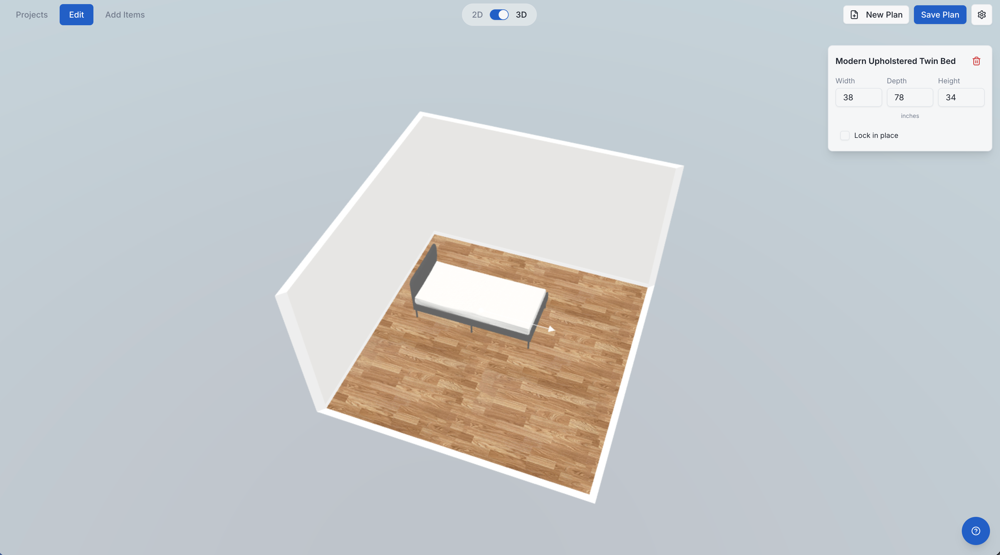
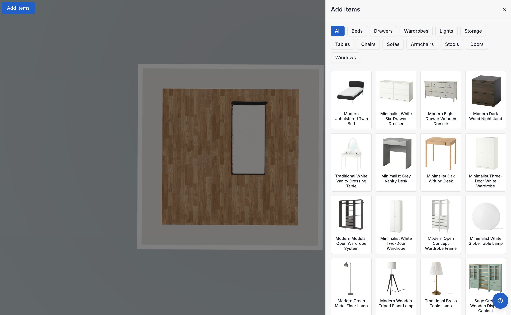

# QuickQuote3D

## Screenshots



*3D view with real-time context menu for item dimensions*



*Furniture catalog with categorized browsing*

---

## Features

- **2D/3D View Toggle** — Switch between a top-down floorplan editor and an interactive 3D perspective
- **Wall Drawing** — Draw, move, and delete walls with snapping and measurement overlays
- **Furniture Placement** — Drag-and-drop items from a categorized catalog (beds, sofas, tables, chairs, wardrobes, lights, storage, doors, windows, bathroom fixtures, and more)
- **Item Controls** — Resize, rotate, and lock items in place; real-time dimension display in any unit
- **Texture Customization** — Apply floor and wall textures per room surface
- **Room Templates** — Start from a blank canvas or pre-built room layouts
- **Save & Load** — Persist floor plans to browser **IndexedDB** — no account, no server
- **My Floor Plans** — Browse, load, and delete saved designs with thumbnail previews
- **Multi-language** — Built-in i18n support: English, 简体中文, 繁體中文
- **Unit System** — Inches/feet, meters, centimeters, or millimeters
- **Responsive** — Works on desktop and touch devices

---

## Repository Structure

```
QuickQuote3d/
├── src/                        # Core library (TypeScript + Three.js)
│   ├── QuickQuote3d.ts          # Main QuickQuote3d class
│   ├── constants.ts
│   ├── core/                   # Utils, configuration, dimensioning, events
│   ├── model/                  # Floorplan, Corner, Wall, Room, Scene
│   ├── items/                  # Item types (floor, wall, in-wall, etc.)
│   ├── three/                  # Three.js renderer, controller, HUD, lights
│   ├── floorplanner/           # 2D canvas floorplan editor
│   ├── loaders/                # OBJ/MTL model loader
│   ├── indexdb/                # Template persistence via IndexedDB
│   ├── types/                  # Shared TypeScript types
│   └── templates/              # Built-in JSON room templates
│
├── app/                        # Next.js 15 demo application
│   ├── app/[locale]/           # Locale-aware routing (en / zh / tw)
│   ├── components/
│   │   ├── blueprint3d/        # All UI components (20+)
│   │   └── ui/                 # shadcn/ui base components
│   ├── services/
│   │   └── storage.ts          # IndexedDB CRUD (replaces any backend API)
│   ├── messages/               # i18n JSON files (en, zh, tw)
│   ├── i18n/                   # next-intl routing & request config
│   ├── hooks/                  # use-window-size, use-media-query
│   ├── stores/                 # Zustand stores
│   ├── lib/                    # utils, constants, blueprint-templates config
│   └── types/                  # Blueprint type definitions
│
└── docs/                       # Screenshots and assets
```

---

## Getting Started

### Prerequisites

- Node.js 18+
- [pnpm](https://pnpm.io/) 8+

### Installation

```bash
git clone https://github.com/charmlinn/blueprint3d-modern.git
cd blueprint3d-modern

# Install root dependencies (core library)
pnpm install

# Install app dependencies
cd app && pnpm install
```

### Development

```bash
# From repo root
pnpm dev

# Or directly in app/
cd app && pnpm dev
```

Open [http://localhost:3000](http://localhost:3000) in your browser.

### Production Build

```bash
cd app && pnpm build
```

---

## Core Library (`src/`)

The `src/` directory is a standalone TypeScript library that can be used independently of the Next.js app.
```

### Key Classes

| Class | Description |
|-------|-------------|
| `QuickQuote3d` | Root class — wires together the model, 2D floorplanner, and 3D renderer |
| `Model` | Owns the `Floorplan` and `Scene`; handles serialize/deserialize |
| `Floorplan` | Wall and corner graph; emits geometry change events |
| `Floorplanner` | 2D canvas controller (draw / move / delete modes) |
| `ThreeMain` | Three.js scene setup, camera, raycasting, item interaction |
| `Item` / subtypes | Furniture items: `FloorItem`, `WallItem`, `InWallItem`, etc. |
| `Factory` | Loads OBJ+MTL models from URL and instantiates the right `Item` subtype |

---

## Internationalization

| Code | Language |
|------|----------|
| `en` | English |
| `zh` | 简体中文 |
| `tw` | 繁體中文 |

---

## Tech Stack

| Layer | Technology | Version |
|-------|-----------|---------|
| 3D Renderer | [Three.js](https://threejs.org/) | 0.181.2 |
| Animation | [anime.js](https://animejs.com/) | 4.3.6 |
| Framework | [Next.js](https://nextjs.org/) | 15.5.14 |
| UI Runtime | [React](https://react.dev/) | 19.2.4 |
| Styling | [Tailwind CSS](https://tailwindcss.com/) | 4.2.2 |
| Components | [Radix UI](https://www.radix-ui.com/) primitives | — |
| State | [Zustand](https://zustand-demo.pmnd.rs/) | 5.0.12 |
| Animations | [Framer Motion](https://www.framer.com/motion/) | 11.18.2 |
| i18n | [next-intl](https://next-intl-docs.vercel.app/) | 3.26.5 |
| Notifications | [Sonner](https://sonner.emilkowal.ski/) | 1.7.4 |
| Storage | IndexedDB (browser-native) | — |
| Language | TypeScript | 5.x |
